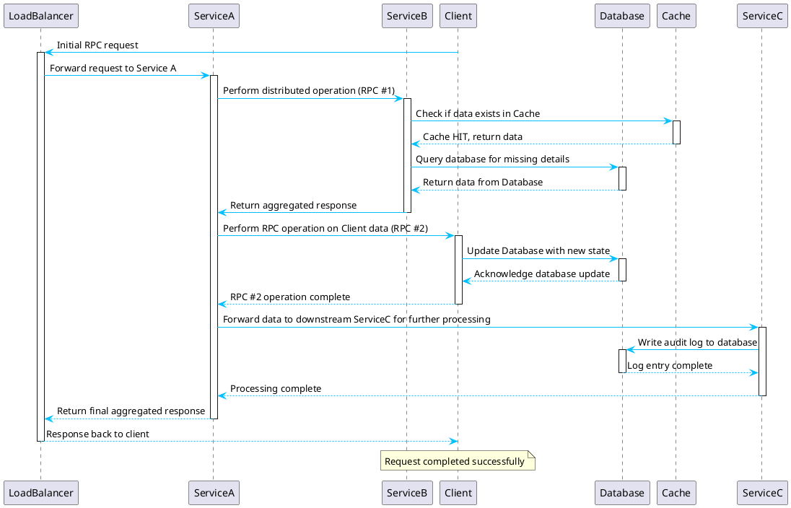
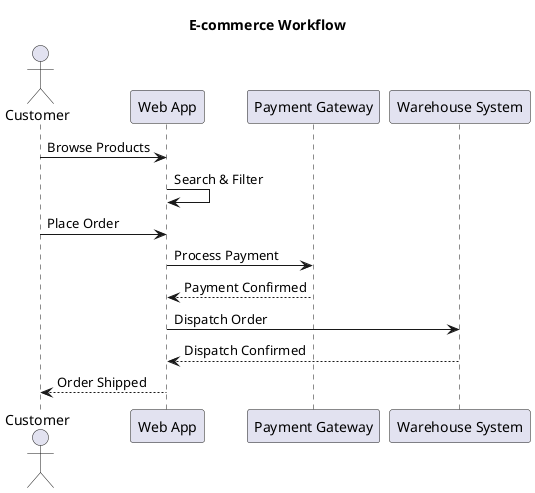
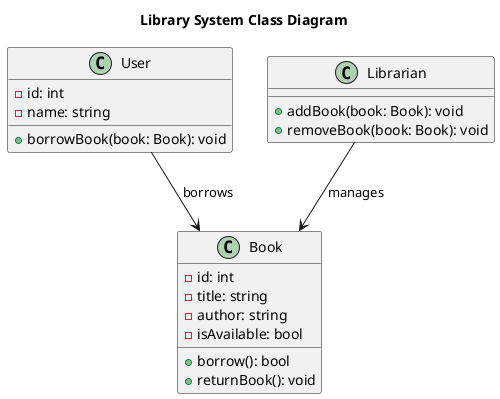
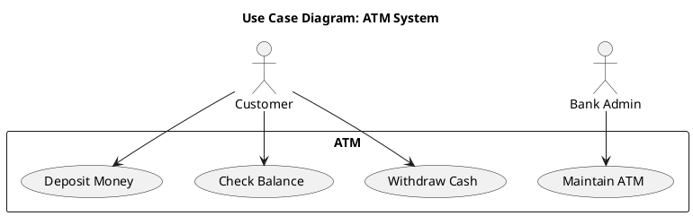
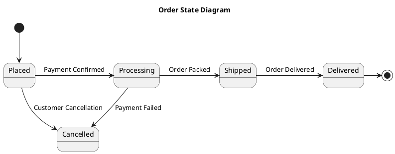
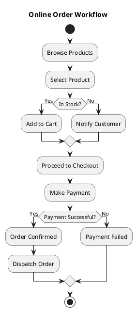
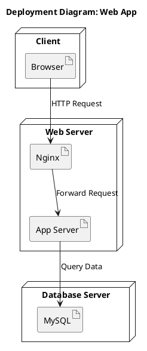
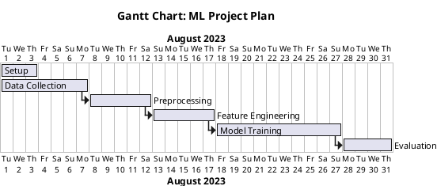

```plantuml
@startuml
skinparam sequence {
    ArrowColor DeepSkyBlue
    ParticipantFontColor Black
    LifeLineColor #d3d3d3
    BackgroundColor AliceBlue
}

participant Client as C
participant LoadBalancer as LB
participant ServiceA as A
participant ServiceB as B
participant ServiceC as C
participant Database as DB
participant Cache as Cache

C -> LB : Initial RPC request
activate LB
LB -> A : Forward request to Service A
activate A

A -> B : Perform distributed operation (RPC #1)
activate B

B -> Cache : Check if data exists in Cache
activate Cache
Cache --> B : Cache HIT, return data
deactivate Cache

B -> DB : Query database for missing details
activate DB
DB --> B : Return data from Database
deactivate DB

B -> A : Return aggregated response
deactivate B

A -> C : Perform RPC operation on Client data (RPC #2)
activate C

C -> DB : Update Database with new state
activate DB
DB --> C : Acknowledge database update
deactivate DB

C --> A : RPC #2 operation complete
deactivate C

A -> ServiceC : Forward data to downstream ServiceC for further processing
activate ServiceC

ServiceC -> DB : Write audit log to database
activate DB
DB --> ServiceC : Log entry complete
deactivate DB

ServiceC --> A : Processing complete
deactivate ServiceC

A --> LB : Return final aggregated response
deactivate A

LB --> C : Response back to client
deactivate LB

note over C : Request completed successfully
@enduml

```

```plantuml

@startuml
title E-commerce Workflow

actor Customer
participant "Web App" as WA
participant "Payment Gateway" as PG
participant "Warehouse System" as WH

Customer -> WA: Browse Products
WA -> WA: Search & Filter
Customer -> WA: Place Order
WA -> PG: Process Payment
PG --> WA: Payment Confirmed
WA -> WH: Dispatch Order
WH --> WA: Dispatch Confirmed
WA --> Customer: Order Shipped

@enduml
```

```plantuml

@startuml
title Library System Class Diagram

class Book {
  - id: int
  - title: string
  - author: string
  - isAvailable: bool
  + borrow(): bool
  + returnBook(): void
}

class User {
  - id: int
  - name: string
  + borrowBook(book: Book): void
}

class Librarian {
  + addBook(book: Book): void
  + removeBook(book: Book): void
}

User --> Book: borrows
Librarian --> Book: manages
@enduml
```

```plantuml
@startuml
title Use Case Diagram: ATM System

actor Customer
actor "Bank Admin" as Admin
rectangle ATM {
  usecase "Withdraw Cash"
  usecase "Check Balance"
  usecase "Deposit Money"
  usecase "Maintain ATM" as Maintain
}

Customer --> "Withdraw Cash"
Customer --> "Check Balance"
Customer --> "Deposit Money"
Admin --> Maintain
@enduml
```

```plantuml

@startuml
title Order State Diagram

[*] --> Placed
Placed -> Processing: Payment Confirmed
Processing -> Shipped: Order Packed
Shipped -> Delivered: Order Delivered
Delivered -> [*]
Processing --> Cancelled: Payment Failed
Placed --> Cancelled: Customer Cancellation

@enduml
```

```plantuml

@startuml
title Online Order Workflow

start
:Browse Products;
:Select Product;
if (In Stock?) then (Yes)
  :Add to Cart;
else (No)
  :Notify Customer;
endif
:Proceed to Checkout;
:Make Payment;
if (Payment Successful?) then (Yes)
  :Order Confirmed;
  :Dispatch Order;
else (No)
  :Payment Failed;
endif
stop
@enduml
```

```plantuml

@startuml
title Deployment Diagram: Web App

node "Client" {
  artifact "Browser"
}

node "Web Server" {
  artifact "Nginx"
  artifact "App Server"
}

node "Database Server" {
  artifact "MySQL"
}

"Browser" --> "Nginx": HTTP Request
"Nginx" --> "App Server": Forward Request
"App Server" --> "MySQL": Query Data
@enduml
```

```plantuml

@startgantt
title Gantt Chart: ML Project Plan

Project starts 2023-08-01
[Setup] lasts 3 days
[Data Collection] lasts 7 days
[Preprocessing] lasts 5 days
[Feature Engineering] lasts 5 days
[Model Training] lasts 10 days
[Evaluation] lasts 4 days

[Preprocessing] starts at [Data Collection]'s end
[Feature Engineering] starts at [Preprocessing]'s end
[Model Training] starts at [Feature Engineering]'s end
[Evaluation] starts at [Model Training]'s end
@endgantt
```