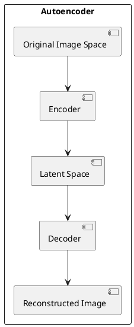
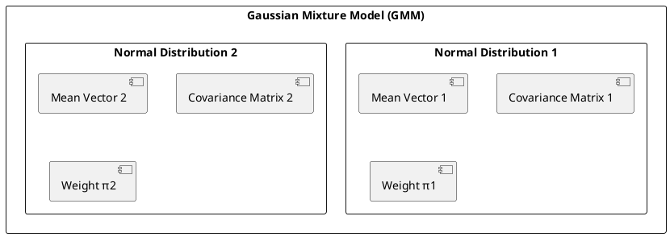

```plantuml
@startuml
skinparam horizontalAlignment center
skinparam packageStyle rectangle

rectangle "Autoencoder" {
    [Original Image Space] --> [Encoder]
    [Encoder] --> [Latent Space]
    [Latent Space] --> [Decoder]
    [Decoder] --> [Reconstructed Image]
}
@enduml
```

```plantuml
@startuml
skinparam horizontalAlignment center
skinparam packageStyle rectangle

rectangle "Gaussian Mixture Model (GMM)" {
    package "Normal Distribution 1" {
        [Mean Vector 1]
        [Covariance Matrix 1]
        [Weight π1]
    }
    package "Normal Distribution 2" {
        [Mean Vector 2]
        [Covariance Matrix 2]
        [Weight π2]
    }
}
@enduml
```
