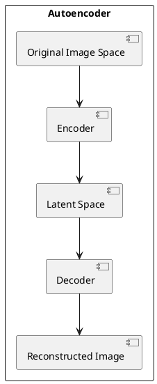

```plantuml
@startuml
skinparam horizontalAlignment center
skinparam packageStyle rectangle

rectangle "Autoencoder" {
    [Original Image Space] --> [Encoder]
    [Encoder] --> [Latent Space]
    [Latent Space] --> [Decoder]
    [Decoder] --> [Reconstructed Image]
}
@enduml
```