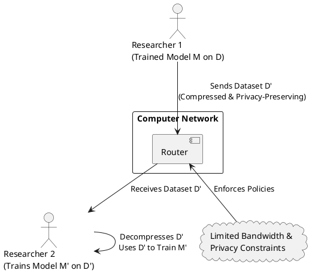

```plantuml
@startuml
skinparam monochrome true

' Define entities
actor Researcher1 as "Researcher 1 \n(Trained Model M on D)"
actor Researcher2 as "Researcher 2 \n(Trains Model M' on D')"
rectangle "Computer Network" {
    component "Router" as R
}

' Network Bandwidth and Privacy Constraints
cloud "Limited Bandwidth & \nPrivacy Constraints" as Constraints

' Data Flow
Researcher1 --> R: Sends Dataset D' \n(Compressed & Privacy-Preserving)
R --> Researcher2: Receives Dataset D'
R <-- Constraints: Enforces Policies
Researcher2 --> Researcher2: Decompresses D' \nUses D' to Train M'

@enduml

```
