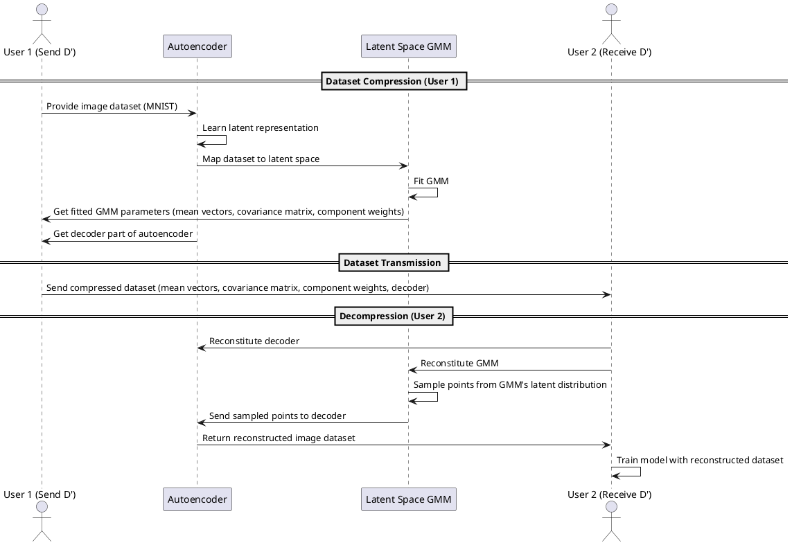

```plantuml
@startuml
actor User1 as "User 1 (Send D')"
participant Autoencoder
participant GMM as "Latent Space GMM"
actor User2 as "User 2 (Receive D')"

== Dataset Compression (User 1) ==
User1 -> Autoencoder: Provide image dataset (MNIST)
Autoencoder -> Autoencoder: Learn latent representation
Autoencoder -> GMM: Map dataset to latent space
GMM -> GMM: Fit GMM
GMM -> User1: Get fitted GMM parameters (mean vectors, covariance matrix, component weights)
Autoencoder -> User1: Get decoder part of autoencoder

== Dataset Transmission ==
User1 -> User2: Send compressed dataset (mean vectors, covariance matrix, component weights, decoder)

== Decompression (User 2) ==
User2 -> Autoencoder: Reconstitute decoder
User2 -> GMM: Reconstitute GMM
GMM -> GMM: Sample points from GMM's latent distribution
GMM -> Autoencoder: Send sampled points to decoder
Autoencoder -> User2: Return reconstructed image dataset
User2 -> User2: Train model with reconstructed dataset

@enduml
```