# Latent Gaussian Compression: Dataset Compression and Reconstruction with Autoencoders and Gaussian Mixture Models

James Zhao, Blaine Arihara, Emily Tang, and Terry Webster

## Abstract
This report explores a machine learning-based approach for compressing and reconstructing large-scale image datasets. We combine autoencoders and Gaussian Mixture Models (GMMs) to create a compact, efficient compressed dataset that is able to be effectively decompressed for classification. We evaluate the effectiveness of this Latent Gaussian Compression (LGC) approach on the MNIST dataset. Our evaluation trains a classifier on the decompressed LGC MNIST training dataset, and the quantifies its accuracy on the test MNIST dataset. To establish a strong baseline, we compared this approach to a data summarization technique using coreset selection with k-medoids to find representative subset for training. For the LGC autoencoder, we experimented with various autoencoder architectures (vanilla autoencoder, VAE, contrastive VAE, and AE) to optimize performance. We further validated our method on the SpuCo (spurious correlation) dataset to assess its robustness to spurious correlations.

## 1. Introduction

The rapid growth of machine learning has led to the proliferation of massive datasets. While these datasets have enabled significant advancements in various fields, they also present significant challenges related to storage, transmission, and computational costs. As datasets continue to grow in size and complexity, the need for efficient compression techniques becomes increasingly critical.

One significant challenge is the transmission of large datasets across networks. Limited bandwidth and high latency can hinder collaborative research and the deployment of machine learning models. Moreover, privacy concerns often restrict the sharing of sensitive data. To address these issues, researchers have explored various techniques for compressing datasets while preserving their essential information.

In this paper, we propose an approach to dataset compression called Latent Gaussian Compression (LGC). LGC leverages the power of autoencoders and Gaussian Mixture Models (GMMs) to create a compact, efficient representation of the dataset. By capturing the underlying data distribution and reconstructing the original data from a compressed latent space, LGC enables efficient data transmission and storage while preserving essential features for machine learning tasks.

Our approach offers several advantages over traditional compression techniques, including preservation of information, preservation of privacy, efficient transmission, and reduced storage costs. Our LGC algorithm focuses on preserving the information relevant for training the classifier, and anonymizes the training dataset by making sure that specific points in the dataset cannot be fully reconstructed, only general distributions. It is able to achieve a >3x compression factor improvement over GZip, and has benefits ranging from more efficient bandwidth utilization to reduced storage costs.

We evaluate the effectiveness of LGC on both regular MNIST and SpuCo MNIST and compare its performance to coreset selection. Our results demonstrate that LGC can achieve significant compression ratios while maintaining high levels of accuracy in downstream machine learning tasks.

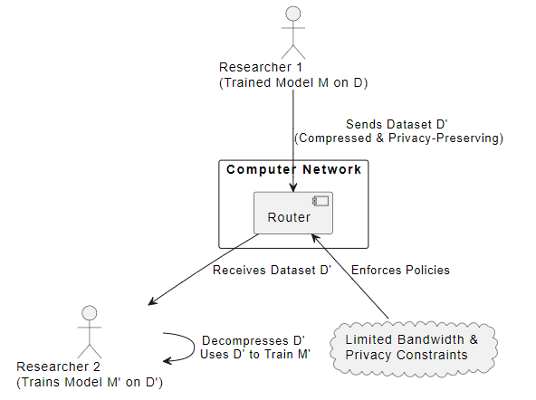

Consider a scenario where two researchers, Researcher 1 and Researcher 2, collaborate on a machine learning project. Researcher 1 has trained a model $M$ on a large dataset $D$. Researcher 2 wants to train a similar model $M'$ on a similar dataset $D'$, but they are constrained by limited bandwidth and privacy concerns.

Using LGC, Researcher 1 can compress their dataset $D$ into a compressed representation $D'$. This compressed representation can be transmitted over the network to Researcher 2 with minimal bandwidth overhead. Researcher 2 can then decompress $D'$ and use it to train their model $M'$, with the additional benefit that only a similar distribution to the original, but not the exact original data points, can be reconstructed.

Our contribution is that we implement several variants of LGC with different autoencoder architectures (vanilla AE, VAE, conditional VAE, with and without contrastive learning) and compare these approaches against a baseline submodular maximization approach using gradient space K-Medoids for coreset selection. We discover a trade-off between compression factor and classifier accuracy and integrate our empirical findings within the broader Information Bottleneck (IB) theoretical framework.

## 2. Related Work

Autoencoders have been used for dimensionality reduction and feature learning in various applications [1]. Variational Autoencoders (VAE) introduce a probabilistic framework for learning latent representations [2]. GMMs are employed for density estimation and data modeling [3]. Submodular maximization techniques have been explored for efficient data selection [4].

### 2.1 CRUST 
To compare the performance of LGC, a CRUST-like data summarization technique was used to find an optimal subset for training. CRUST is a robust coreset selection algorithm for neural networks. Selecting a set of medoids from the gradient space eliminates noisy labels, as clean data with similar gradients will cluster together, resulting in a noise robust summarization of the dataset. This algorithm aims to find a coreset that minimizes the following objective: 

$$ S^{*}(W) = arg min_{S \subseteq V, |S| \leq k} \sum_{i \in V} \min_{j \in S} d_{ij}(W) $$ 

where $d_{ij}(W) = ||\nabla \mathcal{L}(W, x_i) - \nabla \mathcal{L}(W, x_j)||_2$ is the Euclidean distance between the gradients of data points $x_i$ and $x_j$ with respects to the model parameters $W$.

One issue with a gradient-based coreset selection approach for training is that this can be computationally expensive when scaled. This technique often requires the extraction of the gradients of thousands of parameters per data point. For example, an autoencoder can have on the order of $10^5$ trainable parameters, each of which has a corresponding gradient, and it is computationally infeasible to extract and cluster a $10^5$-dimensional space for the $50,000$ training points in our MNIST dataset. 

In contrast, a LGC algorithm offers a less computationally expensive solution to dataset summarization, mapping individual data points into a simple 64-dimensional latent space on which a small number of GMMs can be fitted. By modeling the distribution using GMMs, LGC can scale up or down the compression factor as the complexity of the dataset dictates simply by changing the number of Gaussian components per GMMs, and can learn a wide variety of non-Gaussian distributions.

## 3. Methodology

There are three stages to our LGC algorithm: a compression stage, a transport phase, and a decompression phase. The compression phase is analogous to GZip compression, the transport phase is analogous to transportation of the compressed file, and the decompression phase is analogous to decompressing the received GZip file.
<!-- this would make a pretty flowchart -->

### 3.1 Compression Phase
In the compression phase, an autoencoder, which can be either a vanilla autoencoder or any of the variants we experiment with below, can be used. The encoder portion of the autoencoder maps input images to latent vectors, while the decoder reconstructs the original images from the latent vectors. 

We divide the MNIST dataset into two parts, train and test. The training datset is compressed and modeled using GMMs.

<!-- **Autoencoder Architectures:** -->
#### 3.1.1 Autoencoder Architectures:

The vanilla and variant autoencoder architectures that were experimented with for this project are listed and described below:

- **Vanilla Autoencoder:**
  - The vanilla autoencoder is the baseline version of autoencoder that consists of the basic encoder and decoder components that respectively transform the higher-dimensional input images into lower-dimensional representations. Starting with the MNIST dataset, which are 28 by 28 greyscale (single channel dimension) images, the encoder flattens the input into a 784 dimensional vector and then runs the vector through two dimensional reducing linear layers with rectified linear unit (ReLU) activation functions to transform the image into a 64 dimension latent space vector. The decoder reverses the process by taking in the 64 dimensional latent space vectors and dimensionally increases the image back to its 784 dimensional vector before being reshaped back to its 28 by 28 pixel image.
  - The mean squared error (MSE) reconstruction loss is used to train the model such that the averaged squared errors between the reconstructed image and the original image is minimized. For the autoencoder this is the only loss function that is being minimized.
  $$MSE = \frac{1}{n}\sum_{i=1}^{n} (y_i - \hat{y_i})^2$$
  - t-Distributed Stochastic Neighbor Embedding (tSNE) is a dimensional reduction technique that attempts to preserve higher dimensional structure in a lower dimension typically for visualization. The tSNE plot below is a 2-dimensional visualization of the 64-dimensional latent vectors of the 10 classes of the MNIST dataset color-coded by class. It can seen that the encoder is transforming examples of the same class in roughly similar locations in latent space, while placing examples from different classes in different locations in latent space. This plot gives the intution of the latent encodings of different classes that the GMM is attempting to decompose into multiple gaussian distributions.

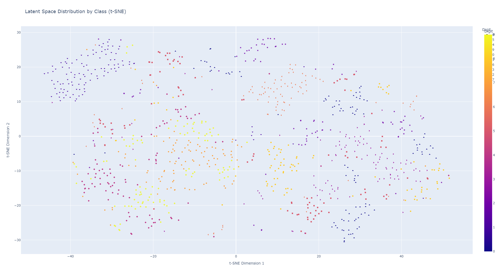

- **Variational Autoencoder (VAE)**
  - The variational autoencoder (VAE) is a probabilistic extension of the vanilla autoencoder (AE) that replaces the determinstic functionality of the encoder and decoder of an AE with probability distributions. The AE compresses a single image into a latent representation, and then reconstructs an image from that latent. The VAE takes a single image and learns a continuous probability distribution for its latent representation. This probability distribution is modeled as a normal distribution characterized by means and covariances with dimensions that of the latent dimension. Two neural networks comprise the encoder, where one learns how to represent the means of input images and the other learns how to represent the covariances of the input images. Knowing the mean and covariance of a normal distribution allows the distribution to be known entirely, so when an image is encoded by its means and covariances, it is encoded as a latent space probability distribution. To decode the image from its latent, a random sample can be drawn from the distribution that has mean and covariance determined by the neural networks applied to that image. The sample will then get passed through two more sets of neural networks that will map the latent into normal distributions of what the images look like. Similar to the encoder, the decoder is comprised of two neural networks, one which takes the sampled latent representation and determines its means in image space, and the other which determines its covariances in image space. These determined means and covariances describe the image space probability distribution of the latent, from which a random sample can be drawn to return a reconstructed image.
  - The loss function for the VAE involves defining an Evidence Lower Bound (ELBO) that allows for the probabilistic terms of the image space distribution to be defined as a Kullback-Leibler (KL) divergence. Because the image space distribution is intractable and unable to be written down, it needs to be approximated by the the latent space distribution, such that minimizing the KL divergence term tightens the ELBO, which allows it to more closely approximate the log likelihood, which is equivalent to minimizing the mean squared error of the reconstructed image. This allows an explicit loss function to be derived which can be optimized. A trick is needed to back propagate through the sampling operation, called the Reparameterization trick, which allows for a random sampling of noise from a unit Gaussian to be multiplied by the covariance and added to the mean of the determined latent probability distribution. This allows for the sampling operation to be performed while introducing arithmetic operations into the computational graph needed to compute gradients through the neural networks. Below is the KL divergence term that measures the difference between the approximate posterior $q(z|x)$, which is the conditional distribution of the latents z given an image x, and the prior $p(z)$, which is the assumed unit Gaussian distribution over latents z prior to seeing any data. $$KL(q(z|x)||p(z)) = \int{q(z|x)log\frac{q(z|x)}{p(z)}dz}$$ When the approximate posterior $q(z|x)$ is parameterized as a Guassian distribution, $\mathcal{N}(\mu_\phi, \Sigma_\phi)$ with the mean and covariances determined by the encoder, the KL divergence can be represented by the closed-form solution: $$KL(q(z|x)||p(z)) = \frac{1}{2}\sum_{i=1}^d(\Sigma_i + \mu_i^2 - 1 - log\Sigma_i)$$
  - Below is the tSNE plot that shows the encoder representing the images of every class as a normal Gaussian distribution, where every image is encoded to have its own unique latent z values. The z values for any image are continuous and can take on any value in latent space, and are defined by the mean and covariances learned for that image by the encoder. The scattered nature of the latents of different classes is the result of the KL divergence term pulling all the latents given an image, $q(z|x)$, closer to the assumed unit Gaussian distribution, $p(z)$. 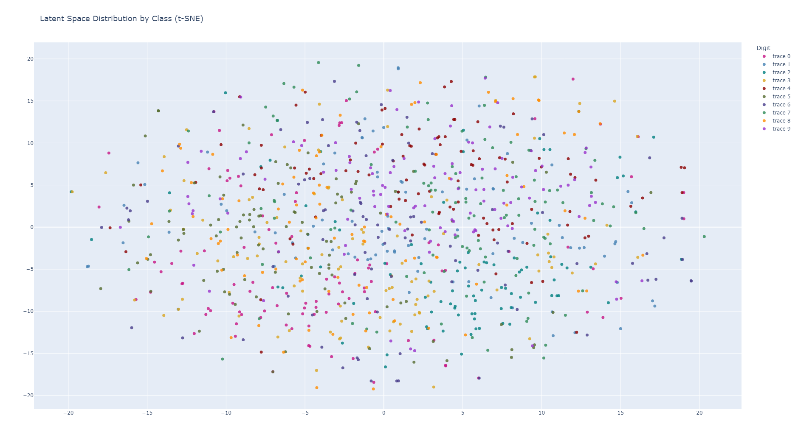 This scattered distribution of latents across all classes makes it difficult to sample an image reconstruction from a desired class. Sampling random unit Gaussian latent samples results in random reconstruction of images, as seen below, where every reconstructed image started from a random unit Gaussian latent sample. The conditional VAE addresses this. 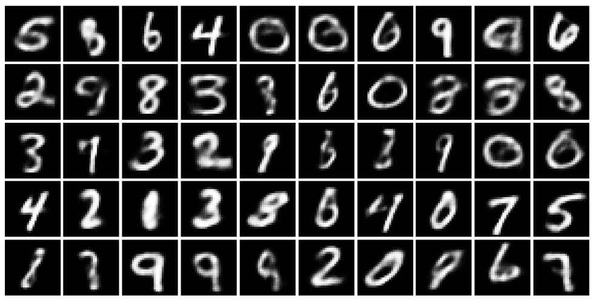

- **Vanilla Autoencoder with Contrastive Learning:**
  - Contrastive learning is a technique that can be applied to supervised or self-supervised machine learning. In the self-supervised case, contrastive learning works to pull augmentations of the same example closer together, as well as similar examples with similar augmentations closer together, while pushing dissimilar examples with dissimilar augmentations away, such that different clusterings of examples can be labeled as classes. Supervised contrastive learning does the same thing, but has the advantage of knowing the labels of the examples so that it can effectively pull examples of the same class closer together, while knowing which examples in other classes to push away. The supervised contrastive loss term is defined as below: $$\mathcal{L}_{SCL} = \frac{1}{|I|} \sum_{i \in I} \frac{-1}{|P(i)|} \sum_{p \in P(i)} \log \frac{\exp(\mathbf{z}_i \cdot \mathbf{z}_p / \tau)}{\sum_{a \in A(i)} \exp(\mathbf{z}_i \cdot \mathbf{z}_a / \tau)}$$
    - $I$: Set of all indices in the batch.
    - $P(i) $: Set of indices of positives for the anchor $i$ (samples from the same class as $i$).
    - $A(i)$: Set of all indices except $i$ itself.
    - $\mathbf{z}_i$: Normalized embedding of sample $i$.
    - $\tau$: Temperature scaling parameter.

  - When taking the vanilla autoencoder architecture and adding a contrastive loss term, the effect that it has on clustering in-class examples is apparent. The tSNE plot below shows the effect that the contrastive loss has on how the encoder transforms examples to latent space. It is clear that the encoder is learning to place examples of the same class closer together in latent space, while pushing examples in other classes away from each other.
  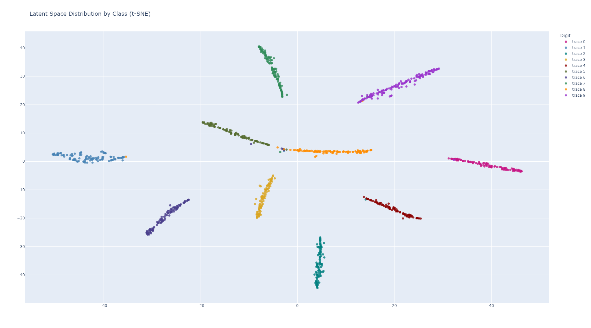

- **Variational Autoencoder with Contrastive Learning:**
  - Taking the VAE previously described and adding a contrastive loss term produces the tSNE plot below. This VAE with contrastive learning now has three loss terms that are guiding the gradient computations: one for cross entropy image recontrustion, a second for KL divergence, and a third for contrastive learning. It can be seen the interplay of the KL divergence term and the contrastive loss term, as the KL divergence term pulls all examples closer to a unit Gaussian distribution, while the contrastive loss term pulls examples within classes towards each other.
  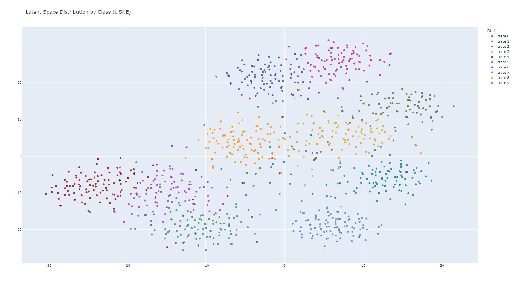

- **Conditional Variational Autoencoder:**
  - The conditional variational autoencoder (CVAE) is a variant of the VAE that incorporates conditioning information into the encoding and decoding steps. This conditioning information is implemented as a one-hot encoding of the images' labels. This one-hot encoding is appended to the flattened image input prior to the encoder, as well as appended to the latent encodings prior to the decoder. This provides conditioning information to the training data for the encoder and decoder to learn associations between examples within a class and their one-hot encodings. This allows for conditioning the random sampling of a latent to reconstruct an image from a desired class. The latent distributions do not show obvious clustering around one-hot encoded groupings, so the tSNE plot for the CVAE looks similar to the VAE, shown below:
  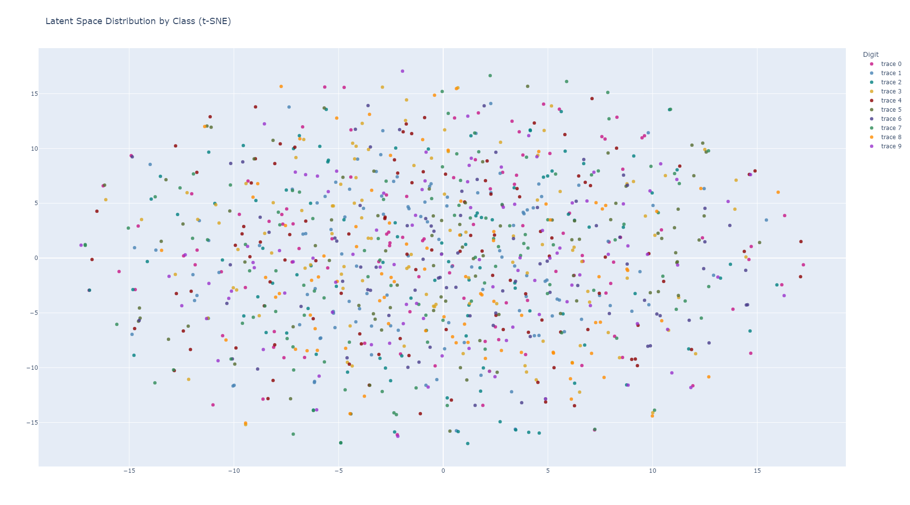 However, the one-hot information is encoded in the latent data such that appending the one-hot encodings to a random sampling of unit Gaussian latent samples allows for images from a desired class to be reconstructed. Below are conditionally-sampled reconstructions from each class, showing that the one-hot encodings allow for the model to learn coded locations in latent space associated with each class. 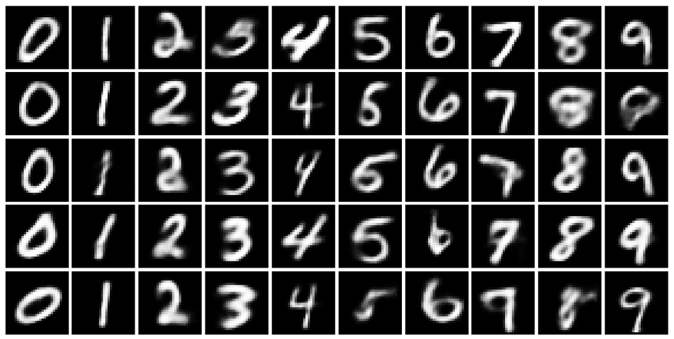

Next, the latent vectors obtained from the encoder part of the autoencoder are used to fit a GMM. The GMM models the distribution of latent representations as a mixture of Gaussian components according to the following probability density function:

$$p(z) = \sum{k=1}^K \pi_k \mathcal{N}(x | \mu_k, \Sigma_k)$$

where:

- `K`: Number of mixture components.
- `π_k`: Mixing coefficient for the k-th component, representing the probability of selecting the k-th component. 
- `N(x | μ_k, Σ_k)`: Probability density function of a Gaussian distribution with mean `μ_k` and covariance matrix `Σ_k`.

**Interpretation:**

The GMM PDF represents the probability of observing a data point `z` given the parameters of the model. It is a weighted sum of Gaussian distributions, where each Gaussian component contributes to the overall probability based on its mixing coefficient.

TODO add a simple visualization of GMM distribution learning as well as an explanation of log-likelihood.

The output of the compression phase are the learned parameters of the fitted GMM (mean vectors, covariance matrices, and component weights) and the decoder part of the autoencoder.

### 3.2 Transport Phase
In the transport phase, we serialize the parameters of the GMM and the decoder part of the autoencoder using standard serialization libraries, and then compress the serialized file using the standard compression algorithm GZip. The intuition behind extracting the parameters from the GMM is that a each Gaussian component consists of a component weight, a mean vector, and a covariance matrix, which contain far less parameters than the original data itself. For example, if we fit a 5-component GMM on the 64-dimensional latent space consisting of 10,000 64-dimensional vectors, the total number of parameters of the GMM is 

$$5 \times (64 + 64 * 64 + 1) = 4161 $$

which is far less than the 640,000 parameters of the original latent space data. In practice, the 64x64 covariance matrix of each Gaussian component can be further compressed with matrix compression techniques. The decoder also occupies a modest size when compared to the original data, and can be further compressed using pruning and quantization techniques.

### 3.3 Decompression Phase

During the decompression phase, the receiver receives a compressed representation of the dataset consisting of GMM paramters and decoder. The receiver then fully reconstructs the GMM using the GMM parameters.

Samples are then drawn based on the reconstructed GMM's probability distrbution. Recall that a GMM consists of $k$ Gaussian distributions, each with weight $\pi_i$. To draw a sample, the reconstruction algorithm first randomly selects a Gaussian component with probability proportional to its weight $\pi_i$. After selecting the Gaussian component, it then randomly draws a sample from the Gaussian distribution based on its $\mu_i$ and $\Sigma_i$ parameters. This sample is a 64-dimensional vector in the latent space. Finally, each sampled latent vector is passed through the decoder to reconstruct the original images. The process is repeated as long as needed to reconstruct a dataset with similar aggregate statistical properties to the original dataset, though the individual points may be different.

### 3.4 Selecting the Optimal Number of Components (K) for GMMs

Determining the optimal number of components (K) in a Gaussian Mixture Model (GMM) is crucial for achieving accurate and robust modeling. Intuitively, if we select too little a number of components, we risk not being able to fully characterize the latent distribution. If we select to large a number of components, we risk overfitting the latent distribution and taking up unneeded space in our compression algorithm. We need to find a criterion to determine when a given $K$ value is enough for our GMM. In this work, we employed the Bayesian Information Criterion (BIC) to select the appropriate number of components for each class in our dataset. 

The BIC score is a statistical criterion that balances model fit with model complexity. It is defined as:

$$ \text{BIC} = k \ln(n) - 2 \ln(\widehat{L}) $$

where:

- `log-likelihood`: The log-likelihood of the data given the model.
- `k`: The number of parameters in the model.
- `n`: The number of data points.

A lower BIC score indicates a better model fit. By comparing BIC scores for different values of K, we can identify the optimal number of components that balances model complexity and predictive accuracy.

For each class in our dataset, we trained GMMs with a varying number of components (K) and calculated their corresponding BIC scores. This analysis was performed for each autoencoder architecture, shown in the plots below.
- **Vanilla Autoencoder:**
  - For the vanilla autoencoder, it can be seen that for most of the classes, around 3 to 8 Gaussian distributions minimized the BIC criterion. The variability across classes reaffirms the already known fact that the latent space distributions generated by the vanilla autoencoder are amorphous, irregular, and unpredictable in their characteristics. Thus the latent space distributions require multiple Gaussian distributions, or multiple GMM components to best characterize them. 
  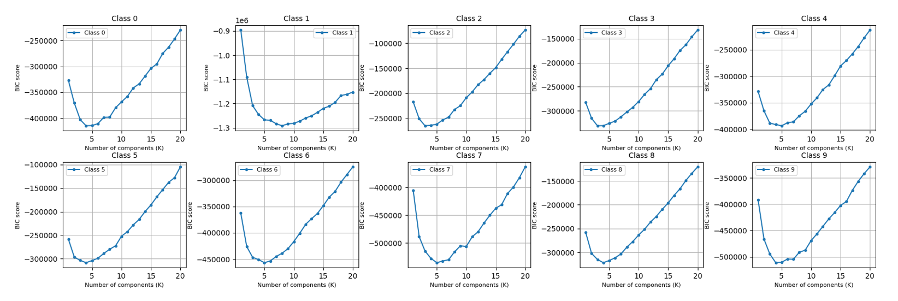

- **Variational Autoencoder (VAE):**
  - For the variational autoencoder, the BIC plots clearly indicate that a single Gaussian distribution is needed to characterize the latent space distribution for all classes. This makes sense because by definition of how the VAE operates, it transforms the inputs into probability distributions characterized by drawing unit Gaussian samples and reparameterizing them to determine their latent encodings. This transformation defines the latent space distributions as multi-dimensional unit Gaussian distributions, so a GMM would require only a one Guassian distrbution to characterize the latent space distribution.
  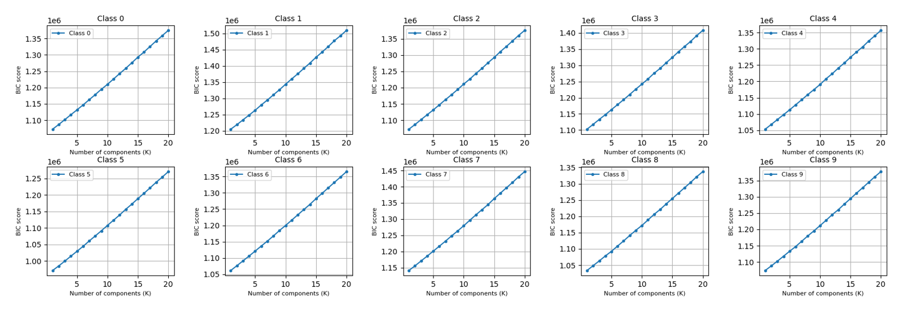

- **Vanilla Autoencoder with Contrastive Learning:**
  - Similar to the vanilla autoencoder, the AE with contrastive learning indicates that around 3 to 6 components are optimal to characterize the latent space distributions. Due to the contrastive loss term, the encoder was incentivized to position examples within classes closer together, which likely caused the examples within a class to be more consolidated. This may have allowed the GMMs to require on average less components to characterize the latent distributions, but still comparable to the vanilla autoencoder.
  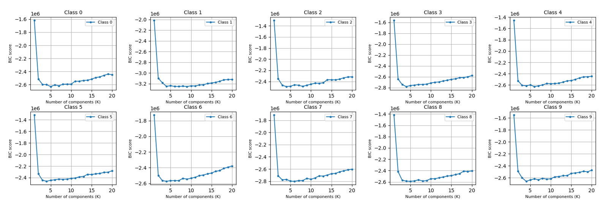

- **Variational Autoencoder with Contrastive Learning:**
  - The VAE with contrastive learning demonstrated to only need a single Gaussian distribution to characterize the latent distributions for all classes, similar to the VAE without contrastive learning. Although the contrastive loss term pulls examples closer together, the KL divergence loss term still forces the encoder to learn to reparameterize the inputs to unit Gaussian distributions.
  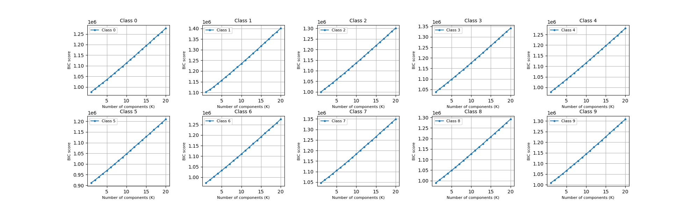

- **Conditional Variational Autoencoder (CVAE):**
  - The conditional VAE expectedly also indicates that only one Gaussian distribution is needed to characterize the latent distributions, similar to the VAE. The CVAE is only different than the VAE in that it appends the one-hot encodings of the images to the inputs of the encoder and decoder, but it would not significantly affect the characteristics of the spread in latent space that the encoder learns to transform images into. So similar to the VAE, the BIC plots suggest one component to be sufficient to characterize the latent distributions.
  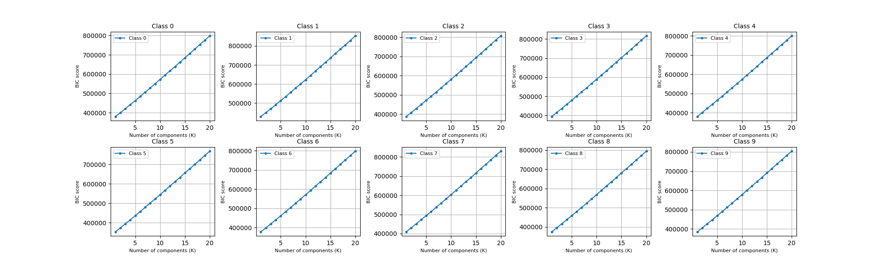

The optimal number of components for each class was selected as the value of K that minimized the BIC score. This ensured that our GMMs effectively captured the underlying data distribution without overfitting or underfitting. This optimal model selection is crucial for accurate data compression and reconstruction.

### 3.5 Metrics for Baseline Comparison
<!-- WIP -->
<!-- TODO: Include background on CNN classifier -->

A Convolutional Neural Network (CNN) classifier is used to evaluate the performance of each model. As a baseline comparison, three methods of training this classifier are taken: (1) Training on the full MNIST training set, (2) training on a random subset of equivalent size to the autoencoder architecture, and (3) training on a subset selected utilizing a CRUST-like data summarization approach for NNs.

Each autoencoder explored resulted in a compressed representation varying between 1-3 MB in size. A subset of 182 examples were extracted from the training data, the equivalent to 3MB of data when GZipped.

### Comparison to Submodular Maximization for Dataset Summarization
A data summarization technique was implemented utilizing the basis of the CRUST algorithm. A subset is selected to minimize the following submodular function, which can be upper bounded as shown in [!!cite CRUST paper]:

$$ S^{*}(W) = arg min_{S \subseteq V, |S| \leq k} \sum_{i \in V} \min_{j \in S} d_{ij}(W) $$ 
 
 To optimize this subset, a CRUST-like approach was implemented by training a neural network to extract the gradients of the loss from the last layer of the network, which has been shown to capture the most variation of the gradient norms. After training the neural network, a k-medoids++ algorithm was implemented to select an optimal coreset for training.

In this implementation, the autoencoders were used as the neural networks for uncovering representative gradients.

<!-- TODO idk if this figure is necessary, TBD -->
<!--  -->

 <!-- The last layer gradients retrieved were 28x28 representations, matching each pixel of an image. These gradients were reduced to a 64-dimensional latent space with Singular Value Decomposition (SVD) before clustering, and projected onto two dimensions using t-SNE for visualization.

The success of this method in creating useful clusters varied with the autoencoder selected. Figure (!TODO) demostrates the resulting projection of a gradient space using the VAE.  -->

<!-- (!! CITE THESE
https://cs.stanford.edu/people/jure/pubs/crust-neurips20.pdf
https://arxiv.org/abs/1803.00942
) -->

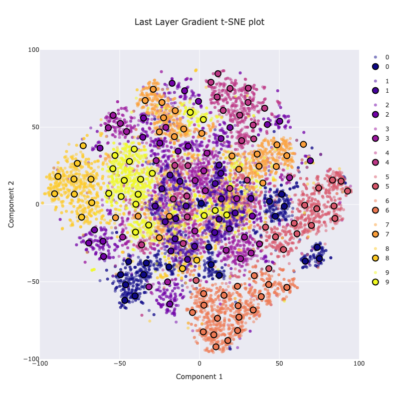

<!-- 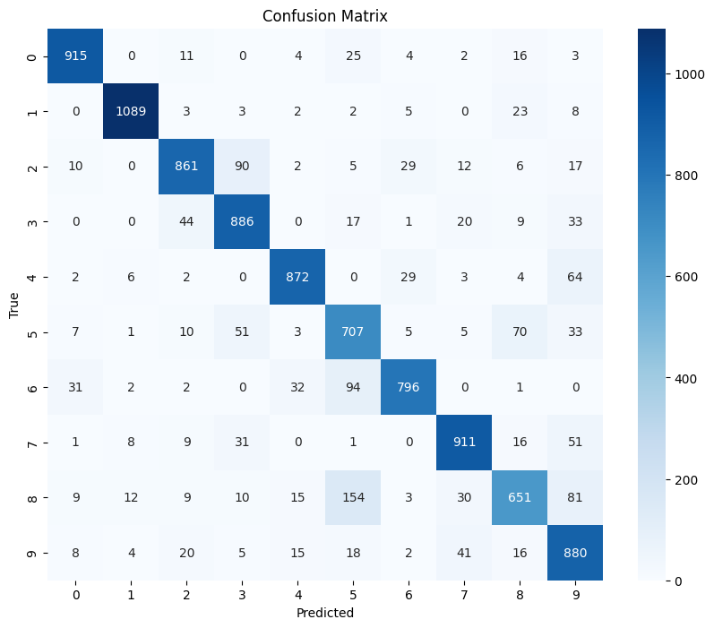 -->

## 4. Experiments and Results

<!-- TODO add more conent and pictures to experiments section -->

### 4.1 Compression Ratio
This LGC approach returns a packaged representation of the dataset fitted GMM (mean vectors, covariance matrices, and component weights) and the decoder part of the autoencoder to be used for image reconstruction and training. Using a GZip compression, the MNIST dataset can be reduced to 82.34% of its original size. With the autoencoder architecture, the size of the dataset can be reduced by nearly 95.98% in size while achieving a 97.85% accuracy on the original MNIST dataset.

| Approach                            |   Percent reduction |   Test accuracy |
|:------------------------------------|--------------------:|----------------:|
| GZip compression only               |               82.34 |           98.36 |
| Random subset                       |               94.32 |           82.64 |
| Gradient subset                     |               94.32 |           85.68 |
| Vanilla autoencoder                 |               94.44 |           95.98 |
| Contrastive autoencoder             |               95.51 |           89.14 |
| Variational autoencoder             |               97.77 |           82.63 |
| Conditional variational autoencoder |               97.36 |           91.34 |
| Contrastive variational autoencoder |               97.77 |           91.84 |

### 4.1 Baseline Comparison

We evaluated the performance of our Latent Gaussian Compression (LGC) approach against several baseline methods, including GZip compression, random subsetting, gradient-based subset selection, and coreset selection with k-medoids. We experimented with various autoencoder architectures (vanilla AE, contrastive AE, VAE, conditional VAE, contrastive VAE, and contrastive VAE with convex hull boundary) within the LGC framework. Our results, illustrated in the figure above, demonstrate a compelling trade-off between compression ratio and test accuracy. 

LGC consistently outperformed baseline methods, especially at higher compression ratios. While coreset selection with k-medoids offered reasonable performance, LGC generally provided superior accuracy, particularly at higher compression levels. 

However, it's important to note that all methods experienced a significant drop in accuracy at extremely high compression ratios. This highlights the inherent trade-off between compression and performance.

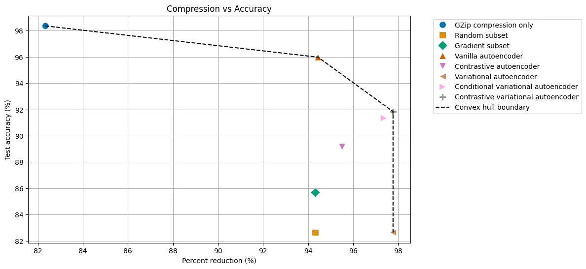

In conclusion, our LGC approach offers a promising solution for compressing large-scale datasets while preserving essential information for downstream tasks. Further research can explore more advanced autoencoder architectures and optimization techniques to further improve the performance of LGC.

## 5. Conclusion

This project investigates the feasibility of LGC for dataset compression and reconstruction. We explore various techniques and analyze the trade-off between compression rate and classification performance. 

## 6. Future Work

TODO add more details

Future work includes exploring:

* Integration of contrastive learning to enhance latent space structure.
* Incorporation of GMM structured priors for complex latent distributions.
* Derivation of theoretical guarantees for information retention as a function of the compression ratio.

One thing we looked into was how our approach would handle spurious correlations by training the autoencoder component of our pipeline on the SpucoMNIST dataset, setting each digit to be highly correlated to different background colors, as opposed to the black and white MNIST images. What we found was that the fully connected autoencoder in our pipeline did not handle spurious correlations very well, and would associate the background colors more than the features of the digits during reconstruction.

We found using a convolutional architecture helped with this and we got better results (See Figure A1 for a diagram of the architecture used).

<table>
  <tr>
    <th>Vanilla VAE Reconstruction</th>
    <th>Convolutional VAE Reconstruction</th>
  </tr>
  <tr>
    <td>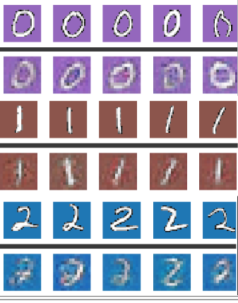</td>
    <td>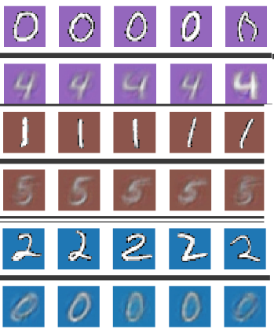</td>
  </tr>
  
</table>

The usage of convolutional architecture for image recognition is not a new idea and dates back to the Lenet architecture from the 1998 paper, which was used to read zip codes and other digits4. It was reported that convolutional networks “ensure some degree of shift, scale, and distortion invariance”, which would have a similar effect to performing augmentations on the data in preprocessing and training on a sequential network5. From this paper it is known that convolutional networks are not sensitive to “shifts and distortions of the input” and that “once a feature has been detected, its exact location becomes less important”5. These capabilities contribute to the robustness of convolutional networks for image recognition, and help mitigate spurious correlations in training. For future work, integrating a convolutional VAE could enable this architecture to be generalized and used for different sets of even more complex images, even those containing a high degree of spurious correlations. 

## 7. References

TODO add a more comprehensive list of references to both here and the paper

  * [1] Hinton, G. E., & Salakhutdinov, R. R. (2006). Reducing the dimensionality of data with neural networks. Science, 313(5786), 504-507.
  * [2] Kingma, D. P., & Welling, M. (2013). Auto-encoding variational 1  inference. arXiv preprint arXiv:1312.6114.
  * [3] Bishop, C. M. (2006). Pattern recognition and machine learning. Springer.
  * [4] “Convolutional Neural Networks (CNNs / ConvNets).” CS231n Convolutional Neural Networks for Visual Recognition Course Website, Stanford https://cs231n.github.io/convolutional-networks/, 12-1-2024.
  * [5] Y. Lecun, L. Bottou, Y. Bengio and P. Haffner, "Gradient-based learning applied to document recognition," in Proceedings of the IEEE, vol. 86, no. 11, pp. 2278-2324, Nov. 1998, doi: 10.1109/5.726791.

## 8. Appendix

TODO add all visualizations from our codebase that are relevant
 Figure A1
 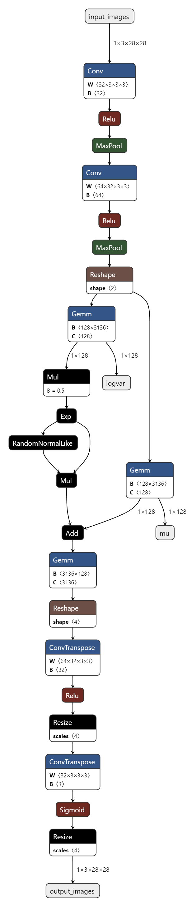
