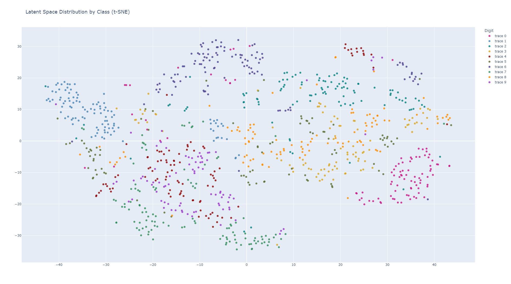

# Latent Gaussian Compression: Dataset Compression and Reconstruction with Autoencoders and Gaussian Mixture Models

## Abstract
This report explores a machine learning-based approach for compressing and reconstructing large-scale image datasets. We combine autoencoders and Gaussian Mixture Models (GMMs) to create a compact, efficient compressed dataset that is able to be effectively decompressed for classification. We evaluate the effectiveness of this Latent Gaussian Compression (LGC) approach on the MNIST dataset. Our evaluation trains a classifier on the decompressed LGC MNIST training dataset, and then quantifies its accuracy on the test MNIST dataset. To establish a strong baseline, we compared our approach to coreset selection with k-medoids. For the LGC autoencoder, we experimented with various autoencoder architectures (vanilla autoencoder, VAE, conditional VAE, contrastive VAE, and AE) to optimize performance. We further validated our method on the SpuCo (spurious correlation) dataset to assess its robustness to spurious correlations.

## 1. Introduction

The rapid growth of machine learning has led to the proliferation of massive datasets. While these datasets have enabled significant advancements in various fields, they also present significant challenges related to storage, transmission, and computational costs. As datasets continue to grow in size and complexity, the need for efficient compression techniques becomes increasingly critical.

One significant challenge is the transmission of large datasets across networks. Limited bandwidth and high latency can hinder collaborative research and the deployment of machine learning models. Moreover, privacy concerns often restrict the sharing of sensitive data. To address these issues, researchers have explored various techniques for compressing datasets while preserving their essential information.

In this paper, we propose an approach to dataset compression called Latent Gaussian Compression (LGC). LGC leverages the power of autoencoders and Gaussian Mixture Models (GMMs) to create a compact, efficient representation of the dataset. By capturing the underlying data distribution and reconstructing the original data from a compressed latent space, LGC enables efficient data transmission and storage while preserving essential features for machine learning tasks.

Our approach offers several advantages over traditional compression techniques, including preservation of information, preservation of privacy, efficient transmission, and reduced storage costs. Our LGC algorithm focuses on preserving the information relevant for training the classifier, and anonymizes the training dataset by making sure that specific points in the dataset cannot be fully reconstructed, only general distributions. It is able to achieve a >3x compression factor improvement over GZip, and has benefits ranging from more efficient bandwidth utilization to reduced storage costs.

We evaluate the effectiveness of LGC on both regular MNIST and SpuCo MNIST and compare its performance to coreset selection. Our results demonstrate that LGC can achieve significant compression ratios while maintaining high levels of accuracy in downstream machine learning tasks.

Consider a scenario where two researchers, Researcher 1 and Researcher 2, collaborate on a machine learning project. Researcher 1 has trained a model $M$ on a large dataset $D$. Researcher 2 wants to train a similar model $M'$ on a similar dataset $D'$, but they are constrained by limited bandwidth and privacy concerns.

Using LGC, Researcher 1 can compress their dataset $D$ into a compressed representation $D'$. This compressed representation can be transmitted over the network to Researcher 2 with minimal bandwidth overhead. Researcher 2 can then decompress $D'$ and use it to train their model $M'$, with the additional benefit that only a similar distribution to the original, but not the exact original data points, can be reconstructed.

Our contribution is that we implement several variants of LGC with different autoencoder architectures (vanilla, VAE, contrastive, conditional) and compare these approaches against a baseline submodular maximization approach using gradient space K-Medoids for coreset selection. We discover a trade-off between compression factor and classifier accuracy and integrate our empirical findings within the broader Information Bottleneck (IB) theoretical framework.

## 2. Related Work

Autoencoders have been used for dimensionality reduction and feature learning in various applications [1]. Variational Autoencoders (VAE) introduce a probabilistic framework for learning latent representations [2]. GMMs are employed for density estimation and data modeling [3]. Submodular maximization techniques have been explored for efficient data selection [4].

### CRUST-based Coreset Selection
<<<<<<< HEAD
One particular technique that we aim to compare LGC against is a CRUST-like compression algorithm. This algorithm clusters points together in the gradient space and then uses k-medoids to select the most central coreset points in the gradient space. It aims to find a coreset $S*$ that minimizes the following objective:
=======
One particular technique that we aim to compare LGC against is a CRUST-like compression algorithm. This algorithm clusters points together in the gradient space and then uses k-medoidsto select the most central coreset points in the gradient space. It aims to find a coreset $S*$ that minimizes the following objective:
>>>>>>> 714c5a3e75fc2b8134896620d18c7c2e92e34187

$$ S*(W) = arg min_{S \subseteq V, |S| \leq k} \sum_{i \in V} \min_{j \in S} d_{ij}(W) $$ 

where $d_{ij}(W) = ||\nabla \mathcal{L}(W, x_i) - \nabla \mathcal{L}(W, x_j)||^2$ is the Euclidean distance between the gradients of data points $x_i$ and $x_j$ with respect to the model parameters $W$. 

One issue with gradient-based coreset selection methods is that they can be computationally expensive, since they often require the extraction of the gradients of thousands of parameters per data point. For example, an autoencoder can have on the order of $10^5$ trainable parameters, each of which has a corresponding gradient, and it is computationally infeasible to extract and cluster a $10^5$-dimensional space for the $50,000$ training points in our MNIST dataset. In contrast, our LGC algorithm offers a less computationally expensive solution to dataset summarization, mapping individual data points into a simple 64-dimensional latent space on which a small number of GMMs can be fitted. By modeling the distribution using GMMs, LGC can scale up or down the compression factor as the complexity of the dataset dictates simply by changing the number of Gaussian components per GMMs, and can learn a wide variety of non-Gaussian distributions.

## 3. Methodology

There are three stages to our LGC algorithm: a compression stage, a transport phase, and a decompression phase. The compression phase is analogous to GZip compression, the transport phase is analogous to transportation of the compressed file, and the decompression phase is analogous to decompressing the received GZip file.

### Compression Phase
In the compression phase, an autoencoder, which can be either a vanilla autoencoder or any of the variants we experiment with below, can be used. We divide the MNIST dataset into two parts, test and train, and train the autoencoder on the test portion. The encoder part of the autoencoder maps input images to latent vectors, while the decoder reconstructs the original images from the latent vectors.

**Autoencoder Architectures:**

The vanilla and variant autoencoder architectures that were experimented with for this project are listed and described below:

- **Vanilla Autoencoder:**
  - The vanilla autoencoder is the baseline version of autoencoder that consists of the basic encoder and decoder components that respectively transform the higher-dimensional input images into lower-dimensional representations. Starting with the MNIST dataset, which are 28 by 28 greyscale (single channel dimension) images, the encoder flattens the input into a 784 dimensional vector and then runs the vector through two dimensional reducing linear layers with rectified linear unit (ReLU) activation functions to transform the image into a 64 dimension latent space vector. The decoder reverses the process by taking in the 64 dimensional latent space vectors and dimensionally increases the image back to its 784 dimensional vector before being reshaped back to its 28 by 28 pixel image.
  - The mean squared error (MSE) reconstruction loss is used to train the model such that the averaged squared errors between the reconstructed image and the original image is minimized.
  $$MSE = \frac{1}{n}\sum_{i=1}^{n} (y_i - \hat{y_i})^2$$
  - t-Distributed Stochastic Neighbor Embedding (tSNE) is a dimensional reduction technique that attempts to preserve higher dimensional structure in a lower dimension typically for visualization. The tSNE plot below is a 2-dimensional visualization of the 64-dimensional latent vectors of the 10 classes of the MNIST dataset. It can seen that the encoder is transforming examples of the same class in roughly similar locations in latent space, while placing examples from different classes in different locations in latent space. This plot gives the intution of the latent encodings of different classes that the GMM is attempting to decompose into multiple gaussian distributions.

Next, the latent vectors obtained from the encoder part of the autoencoder are used to fit a GMM. The GMM models the distribution of latent representations as a mixture of Gaussian components according to the following probability density function:

$$p(z) = \sum{k=1}^K \pi_k \mathcal{N}(x | \mu_k, \Sigma_k)$$

where:

- `K`: Number of mixture components.
- `π_k`: Mixing coefficient for the k-th component, representing the probability of selecting the k-th component. 
- `N(x | μ_k, Σ_k)`: Probability density function of a Gaussian distribution with mean `μ_k` and covariance matrix `Σ_k`.

**Interpretation:**

The GMM PDF represents the probability of observing a data point `z` given the parameters of the model. It is a weighted sum of Gaussian distributions, where each Gaussian component contributes to the overall probability based on its mixing coefficient.

TODO add a simple visualization of GMM distribution learning as well as an explanation of log-likelihood.

The output of the compression phase are the learned parameters of the fitted GMM (mean vectors, covariance matrices, and component weights) and the decoder part of the autoencoder.

### Transport Phase
In the transport phase, we serialize the parameters of the GMM and the decoder part of the autoencoder using standard serialization libraries, and then compress the serialized file using the standard compression algorithm GZip. The intuition behind extracting the parameters from the GMM is that a each Gaussian component consists of a component weight, a mean vector, and a covariance matrix, which contain far less parameters than the original data itself. For example, if we fit a 5-component GMM on the 64-dimensional latent space consisting of 10,000 64-dimensional vectors, the total number of parameters of the GMM is 

$$5 \times (64 + 64 * 64 + 1) = 4161 $$

which is far less than the 640,000 parameters of the original latent space data. In practice, the 64x64 covariance matrix of each Gaussian component can be further compressed with matrix compression techniques. The decoder also occupies a modest size when compared to the original data, and can be further compressed using pruning and quantization techniques.

### Decompression Phase

During the decompression phase, the receiver receives the compressed dataset consisting of GMM paramters and decoder. The receiver then fully reconstructs the GMM using the GMM parameters.

Samples are then drawn based on the reconstructed GMM's probability distrbution. Recall that a GMM consists of $k$ Gaussian distributions, each with weight $\pi_i$. To draw a sample, the reconstruction algorithm first randomly selects a Gaussian component with probability proportional to its weight $\pi_i$. After selecting the Gaussian component, it then randomly draws a sample from the Gaussian distribution based on its $\mu_i$ and $\Sigma_i$ parameters. This sample is a 64-dimensional vector in the latent space. Finally, each sampled latent vector is passed through the decoder to reconstruct the original images. The process is repeated as long as needed to reconstruct a dataset with similar aggregate statistical properties to the original dataset, though the individual points may be different.

### Selecting the Optimal Number of Components (K) for GMMs

Determining the optimal number of components (K) in a Gaussian Mixture Model (GMM) is crucial for achieving accurate and robust modeling. Intuitively, if we select too little a number of components, we risk not being able to fully characterize the latent distribution. If we select to large a number of components, we risk overfitting the latent distribution and taking up unneeded space in our compression algorithm. We need to find a criterion to determine when a given $K$ value is enough for our GMM. In this work, we employed the Bayesian Information Criterion (BIC) to select the appropriate number of components for each class in our dataset. 

The BIC score is a statistical criterion that balances model fit with model complexity. It is defined as:

$$ \text{BIC} = k \ln(n) - 2 \ln(\widehat{L}) $$

where:

- `log-likelihood`: The log-likelihood of the data given the model.
- `k`: The number of parameters in the model.
- `n`: The number of data points.

A lower BIC score indicates a better model fit. By comparing BIC scores for different values of K, we can identify the optimal number of components that balances model complexity and predictive accuracy.

For each class in our dataset, we trained GMMs with a varying number of components (K) and calculated their corresponding BIC scores. The BIC scores were then plotted against the number of components, resulting in the curves shown in Figure 1. The optimal number of components for each class was selected as the value of K that minimized the BIC score.

By carefully selecting the number of components using the BIC criterion, we ensured that our GMMs effectively captured the underlying data distribution without overfitting or underfitting. This optimal model selection is crucial for accurate data compression and reconstruction.

### Comparison to Submodular Maximization for Dataset Summarization
TODO Explores submodular maximization for data selection before applying LGC.

## 4. Experiments and Results

TODO add more conent and pictures to experiments section, incorporate SPUCO

We evaluated the performance of our Latent Gaussian Compression (LGC) approach against several baseline methods, including GZIP compression, random subsetting, gradient-based subset selection, and coreset selection with k-medoids. We experimented with various autoencoder architectures (vanilla, VAE, conditional VAE, contrastive VAE, and contrastive VAE with convex hull boundary) within the LGC framework. Our results, illustrated in the figure above, demonstrate a compelling trade-off between compression ratio and test accuracy. 

LGC consistently outperformed baseline methods, especially at higher compression ratios. While coreset selection with k-medoids offered reasonable performance, LGC generally provided superior accuracy, particularly at higher compression levels. 

However, it's important to note that all methods experienced a significant drop in accuracy at extremely high compression ratios. This highlights the inherent trade-off between compression and performance.

In conclusion, our LGC approach offers a promising solution for compressing large-scale datasets while preserving essential information for downstream tasks. Further research can explore more advanced autoencoder architectures and optimization techniques to further improve the performance of LGC.

## 5. Conclusion

This project investigates the feasibility of LGC for dataset compression and reconstruction. We explore various techniques and analyze the trade-off between compression rate and classification performance. 

## 6. Future Work

TODO add more details

Future work includes exploring:

* Integration of contrastive learning to enhance latent space structure.
* Incorporation of GMM structured priors for complex latent distributions.
* Derivation of theoretical guarantees for information retention as a function of the compression ratio.

One thing we looked into was how our approach would handle spurious correlations by training the autoencoder component of our pipeline on the SpucoMNIST dataset, setting each digit to be highly correlated to different background colors, as opposed to the black and white MNIST images. What we found was that the fully connected autoencoder in our pipeline did not handle spurious correlations very well, and would associate the background colors more than the features of the digits during reconstruction.

We found using a convolutional architecture helped with this and we got better results (See Figure A1 for a diagram of the architecture used).

<table>
  <tr>
    <th>Vanilla VAE Reconstruction</th>
    <th>Convolutional VAE Reconstruction</th>
  </tr>
  <tr>
    <td></td>
    <td></td>
  </tr>
  
</table>

The usage of convolutional architecture for image recognition is not a new idea and dates back to the Lenet architecture from the 1998 paper, which was used to read zip codes and other digits4. It was reported that convolutional networks “ensure some degree of shift, scale, and distortion invariance”, which would have a similar effect to performing augmentations on the data in preprocessing and training on a sequential network5. From this paper it is known that convolutional networks are not sensitive to “shifts and distortions of the input” and that “once a feature has been detected, its exact location becomes less important”5. These capabilities contribute to the robustness of convolutional networks for image recognition, and help mitigate spurious correlations in training. For future work, integrating a convolutional VAE could enable this architecture to be generalized and used for different sets of even more complex images, even those containing a high degree of spurious correlations. 

## 7. References

TODO add a more comprehensive list of references to both here and the paper

  * [1] Hinton, G. E., & Salakhutdinov, R. R. (2006). Reducing the dimensionality of data with neural networks. Science, 313(5786), 504-507.
  * [2] Kingma, D. P., & Welling, M. (2013). Auto-encoding variational 1  inference. arXiv preprint arXiv:1312.6114.
  * [3] Bishop, C. M. (2006). Pattern recognition and machine learning. Springer.
  * [4] “Convolutional Neural Networks (CNNs / ConvNets).” CS231n Convolutional Neural Networks for Visual Recognition Course Website, Stanford https://cs231n.github.io/convolutional-networks/, 12-1-2024.
  * [5] Y. Lecun, L. Bottou, Y. Bengio and P. Haffner, "Gradient-based learning applied to document recognition," in Proceedings of the IEEE, vol. 86, no. 11, pp. 2278-2324, Nov. 1998, doi: 10.1109/5.726791.

## 8. Appendix

TODO add all visualizations from our codebase that are relevant
 Figure A1
 
