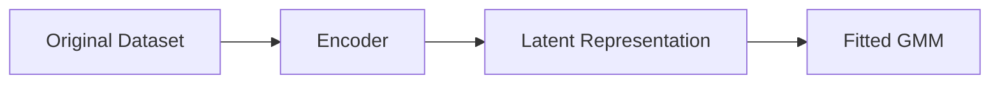
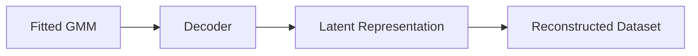

```mermaid
graph LR
A["Original Dataset"] --> B["Encoder"] --> L["Latent Representation"] --> F["Fitted GMM"]
```

```mermaid
graph LR
A["Fitted GMM"] --> B["Decoder"] --> L["Latent Representation"] --> F["Reconstructed Dataset"]
```