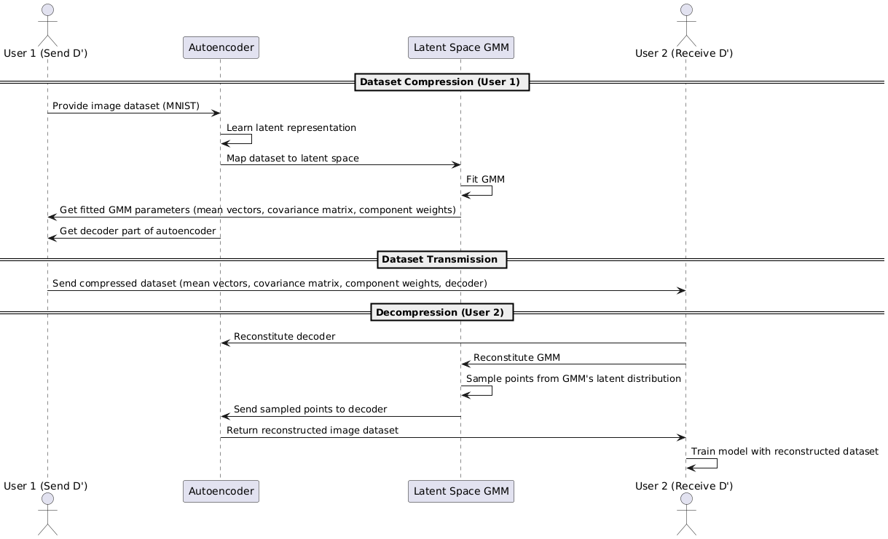

# Latent Gaussian Compression

James Zhao, Blaine Arihara, Emily Tang, Terry Weber

<!-- 
Presentation:
-  Introduction to the problem: compression
- Dataset compression basics
- Problem setup
- Autoencoders
- Variational Autoencoders
- Contrastive Autoencoders
- Gaussian Mixture Models
- Finding Optimal k
- Methods comparison
  - Our Method
  - Submodular Maximization
  - Combined
-->

---

# Problem Setup

Suppose we have a dataset $D = \{Cat, Dog\}$ with two classes and we want to train a classifier.

- The Problem:
  - Cannot store or transmit full dataset $D$ because of
    - Network bandwidth constraints
    - Space constraints
    - Privacy constraints
- Can we share compressed dataset $D'$ (equivalent to coreset $S_k$) instead?

--- 
# Problem Assumptions

---
# Existing Approaches

- Select subset $S*$ and obtain a $\frac{|V|}{|S*|}$ speedup and compression factor

---

# Workflow

---

# Gaussian Mixture Modeling

- Map original data in $R^n (A, B)$ to simpler latent space $R^l (A', B')$ where $l << n$.
- We can approximate the class distributions using Gaussian Mixture Models (GMMs):
  - Represent each class distribution $C' \in (A', B')$ as linear combinations of $k$ Gaussian distributions:

$$
P(z) = \sum_{i=1}^k \pi_i \mathcal{N}(\mu_{k_{C'}}, \Sigma_{k_{C'}}), \quad z \in R^l
$$
---
## Visualizing GMM Distribution Learning

- The image shows the learning of a Gaussian Mixture Model (GMMs) with two components ($k=2$).
- The distribution is a linear combination of the two components, but can be any integer number of components:
$$p(z) = \pi_1 \mathcal{N}(\mu_1, \Sigma_1) + \pi_2 \mathcal{N}(\mu_2, \Sigma_2)$$

---
## Compression with Autoencoders (AE) and GMMs

- Different autoencoders are used to train up an encoder to transform images into lower dimensional latent space
- The decoder is also trained to recover the original image
---

## Autoencoder Architectures and Losses

We experimented with vanilla AE with/without contrastive learning and the Variational AE with/without contrastive learning:
1. **Reconstruction Loss**:

$$
L_{\text{recon}}(x, \hat{x}) = ||x - \hat{x}||^2
$$

2. **KL Divergence (regularizer)**:

$$
L_{\text{KL}} = D_{\text{KL}}(q(z|x) || p(z))
$$

3. **Contrastive Learning Loss**:

$$
L_{\text{CL}} = \frac{1}{2N} \sum_{i=1}^{N} (1 - y_i) D_i^2 + y_i \max(0, m - D_i)^2
$$
---

## Visualizing the AE Latent Space
- t-SNE plots below show the AE encoding space without contrastive learning (left) and with contrastive learning (right)
- The effect of the contrastive loss can clearly be seen to pull examples within a class closer together and push examples outside of a class away from each other

---

## Visualizing the VAE Latent Space
- t-SNE plots below show the same latent space with VAE without contrastive learning (left), and with contrastive learning (right)
- Similarly, the VAE without contrastive loss sees the normalized latent space disitributions intermixed, while contrastive learning can be seen to separate classes

---

## Bayesian Information Criterion (BIC) Curve
- BIC metric is used to determine the appropriate number of k GMMs to decompose into to represent the latent distribution
- The below plots show the BIC plots for each class's distribution, each showing that 2 to 3 GMMs satisfy the criterion of model simplicity and goodness-of-fit

$$ \text{BIC} = k \ln(n) - 2 \ln(\widehat{L}) $$

---
# Baseline Comparison
As a baseline comparison for the performance, subsets of size equal to the compressed model were extracted from the MNIST dataset
- Gradient-Based Clustering
- Random Subset Selection

Each model was evaluated using a CNN classifier

---

# Gradient-Based Exemplar Clustering
Optimization problem:
$$
\arg \min_{S, \gamma_j \geq 0} |S| \quad \text{s.t.} \quad \max_{w \in W} ||\nabla_w F(w, V) - \nabla_w F(w, S)|| \leq \epsilon
$$

1. Train a model (1-3 epochs)
2. Extract last layer gradients
3. k-medoids++ algorithm for exemplar cluster selection 

---
# Baseline Results
### Random Subset
- Test Accuracy on the 10000 test images: 82.64%

---
# Baseline Results
### Gradient Clustering
- Test Accuracy on the 10000 test images: 85.68%

---

# GMM Compression Results
### Auto-Encoder
- Test Accuracy on the 10000 test images: 95.98%
 

---

# Overall Results: Compression vs Accuracy 
 

---

# Information Bottleneck Principle

- A theoretical framework for compression in neural networks.
- Balances:
  - Compression: Reduce information from $x$ to $z$.
  - Relevance: Ensure $z$ retains information about $y$.

---

# **Connection Between VAEs and Information Bottleneck**

- VAEs implicitly optimize an information bottleneck objective by minimizing the following loss:

$$
\mathcal{L} = I(x; z) - \beta I(z; y)
$$

Where:
- $I(x; z)$: Mutual information between $x$ and $z$.
- $I(z; y)$: Mutual information between $z$ and $y$.
- $\beta$: Controls the trade-off.

---

# **Spurious Correlations**

---

# **Spuco Dataset (Large Spurious Feature Difficulty)**

---

# **Vanilla VAE Reconstruction (No Upsampling)**

---

# **Vanilla VAE Reconstruction (With Upsampling)**

---

# **Convolutional VAE Reconstruction (No Upsampling)**

---

# **Convolutional VAE Reconstruction (With Upsampling)**

---
# References
Bishop, Christopher M., and Nasser M. Nasrabadi. Pattern recognition and machine learning. Vol. 4. No. 4. New York: springer, 2006.

Hinton, Geoffrey E., and Ruslan R. Salakhutdinov. "Reducing the dimensionality of data with neural networks." science 313.5786 (2006): 504-507.

Kingma, Diederik P. "Auto-encoding variational bayes." arXiv preprint arXiv:1312.6114 (2013).