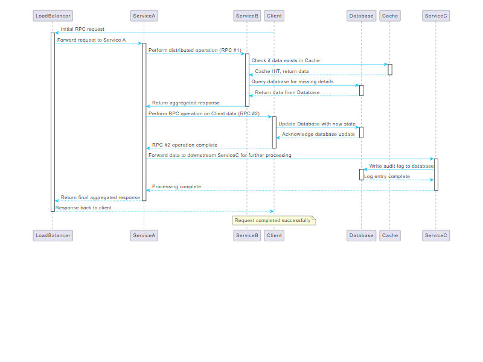

# **Introduction**

## A Comprehensive Presentation of Concepts in Machine Learning and Optimization

---

### Visualization of PlantUML Sequence Diagram




---


# **Problem Setup**

Suppose we have two classes, $A$ and $B$, and we want to train a classifier to distinguish between them.

- **Core Idea**:
  - Extract a **core subset** $S_A$ and $S_B$ from $A$ and $B$ respectively.
  - Identify a decision boundary using compressed representations.

---

# **Encoder-Decoder Architecture**

### Step 1: Projection

1. Use an **encoder** to project the dataset $R^n (A, B)$ into a lower-dimensional space $R^k$ where $k \ll d$.
2. Reconstruct the dataset back to $R^n$.

---

# **Gaussian Mixture Modeling**

- In the reduced space $R^k (A', B')$, the data looks smoother than in $R^n$.
- We can approximate the class distributions using **Gaussian Mixture Models (GMMs)**:
  - Represent the class distributions as linear combinations of Gaussian distributions.

$$
N(\mu_A, \Sigma_A), \quad N(\mu_B, \Sigma_B)
$$

---

# **Gaussian Mixture Model (GMM)**

### Visualizing GMM Distribution Learning


- The image shows the learning of Gaussian Mixture Models (GMMs) with different numbers of clusters ($k=2$ and $k=5$).
- **GMM Objective**:
  - Learn the parameters $\mu_k$ and $\Sigma_k$ to best fit the data distributions.
- **Applications**:
  - Clustering
  - Dimensionality reduction
  - Density estimation

---

# **Compression Step**

To compress the data:

- Learn $\mu_A$, $\Sigma_A$, $\mu_B$, $\Sigma_B$ using **Gaussian Mixture Model Distribution Learning (GMM)**.
- Compressed dataset becomes:
  - $\mu_A, \Sigma_A, \mu_B, \Sigma_B$.
- The decoder maps $R^k \to R^n$.

---

# **Reconstruction Step**

Given $\mu_A, \Sigma_A, \mu_B, \Sigma_B$, and the decoder:

### Step 1: Sampling

- Sample from $N(\mu_A, \Sigma_A)$ and $N(\mu_B, \Sigma_B)$.

### Step 2: Pass Samples Through Decoder

- The samples are passed through the decoder to reconstruct the dataset in $R^n$.

---

# **Reconstructed Dataset**

- The reconstructed dataset approximates the original $R^n (A, B)$.
- This approach provides an efficient way to compress, store, and reconstruct datasets.

# **Kullback-Leibler (KL) Divergence**

The formula for KL divergence between a reference probability distribution $P$ and a second probability distribution $Q$ is:

$$
D_{KL} (P || Q) = \sum_{x \in \chi} P(x) \log\left(\frac{P(x)}{Q(x)}\right)
$$

- **Interpretation**: The expected excess surprise from using $Q$ as a model instead of $P$.

---

# **Reconstruction Loss**

The code to compute the reconstruction loss:

```python
from torch.nn import functional as F

def reconstruction_loss(x, x_hat):
    return F.binary_cross_entropy(x_hat, x, reduction="sum")
```

- Inputs: `x` and `x_hat` have dimensions $(N, 1, H, W)$.
- **Explanation**: This computes the negative log-likelihood of the Bernoulli distribution.

---

# **Adversarial Optimization**

1. **Adversarial Loss Minimization**:

$$
\min_{\delta \in C} L(x_t, y_{\text{adv}}, \theta(\delta))
$$

2. **Training Loss**:

$$
\theta(\delta) = \arg \min_{\theta} \sum_{i \in V} L(x_i + \delta_i, y_i, \theta)
$$

3. **Perturbation Class**:

$$
C = \{\delta \in \mathbb{R}^{n \times m} : ||\delta||_{\infty} \leq \epsilon, \delta_i = 0 \, \forall i \notin V_p\}
$$

---

# **Second-Order Approximation**

A second-order approximation of $F(w + \delta)$:

$$
F(w + \delta) = \frac{1}{2} \delta^T H_S \delta + g_S^T \delta + F(w)
$$

- $g_S = \nabla_w F(w, S)$: Gradient.
- $H_S$: Hessian matrix.

---

# **Federated Learning Objectives**

1. **Global Objective**:

$$
F_{\text{glob}}(w) = \sum_{k=1}^{m} p_k F_k(w)
$$

2. **FedProx Regularization**:

$$
\min_{w_{\text{loc}}} F_k(w_{\text{loc}}) + \frac{\mu}{2} ||w_{\text{loc}} - w_t||^2
$$

3. **q-FFL Loss**:

$$
\min_{w_M} F(w_M) = \frac{1}{q+1} \sum_{k=1}^{m} p_k F_k(w_M)^{q+1}
$$

---

# **Submodularity Properties**

1. **Diminishing Gains**:

$$
F(A \cup \{e\}) - F(A) \geq F(B \cup \{e\}) - F(B)
$$

2. **Union-Intersection**:

$$
F(S) + F(T) \geq F(S \cup T) + F(S \cap T)
$$

3. **Monotonicity**:

$$
F(A) \leq F(B) \quad \forall A \subset B
$$

---

# **Gradient-Based Clustering**

The optimization problem is:

$$
\arg \min_{S, \gamma_j \geq 0} |S| \quad \text{s.t.} \quad \max_{w \in W} ||\nabla_w F(w, V) - \nabla_w F(w, S)|| \leq \epsilon
$$

---

# **Greedy Algorithms**

1. **Subset Selection**:

$$
F(S_k) \geq \left(1 - \frac{1}{e}\right) F(\text{OPT})
$$

2. **Complexity**:

- Time Complexity: $O(nk)$.

---

# **Hessian-Based Optimization**

The bound is:

$$
d_{ij} \leq \text{constant} \times ||x_i - x_j||
$$

This guides the selection of core sets $S^*$ for efficient learning.

---

# **Summary**

- Explored concepts in optimization, adversarial learning, and federated learning.
- Applied submodularity and second-order approximations to enhance efficiency.
- Addressed practical scenarios with examples and mathematical rigor.

---

# **Autoencoders**

- Autoencoders are neural networks designed for unsupervised learning.
- They consist of two main parts:
  1. **Encoder**: Maps input \(x\) to a lower-dimensional latent representation \(z\).
  2. **Decoder**: Reconstructs \(x\) from \(z\).

---

# **Architecture of Autoencoders**

```plaintext
Input --> Encoder --> Latent Space --> Decoder --> Output
```

- **Objective**:
  Minimize reconstruction loss \(L(x, \hat{x})\).

---

# **Reconstruction Loss**

The reconstruction loss measures how well the autoencoder reconstructs the input:

$$
L(x, \hat{x}) = ||x - \hat{x}||^2
$$

Alternatively, for binary data:

$$
L(x, \hat{x}) = - \sum_{i} \left[ x_i \log(\hat{x}_i) + (1 - x_i) \log(1 - \hat{x}_i) \right]
$$

---

# **Compression with Autoencoders**

- **Goal**: Reduce the dimensionality of the input while retaining essential information.
- Latent space acts as a compressed representation.
- Applications:
  - Image compression.
  - Dimensionality reduction.

---

# **Lemma: Gradient Descent Convergence**

**Lemma**: For a differentiable convex function \(f(w)\) with a Lipschitz-continuous gradient \(L\), the gradient descent update:

$$
w_{t+1} = w_t - \eta \nabla f(w_t)
$$

with learning rate \( \eta \leq \frac{1}{L} \), satisfies the following convergence property:

$$
f(w_{t+1}) - f(w^*) \leq \frac{1}{2\eta} ||w_t - w^*||^2 - \frac{1}{2\eta} ||w_{t+1} - w^*||^2
$$

where \(w^*\) is the global minimum of \(f(w)\).

---


# **Limitations of Standard Autoencoders**

- They struggle to learn meaningful latent spaces.
- Lack of control over latent representations.
- Enter **Variational Autoencoders (VAEs)**.

---

# **Variational Autoencoders (VAEs)**

- **VAEs** extend autoencoders to probabilistic models.
- Instead of a fixed latent \(z\), VAEs learn a probability distribution \(p(z|x)\).
- Outputs are sampled from this distribution.

---

# **VAE Architecture**

```plaintext
Input --> Encoder --> Latent Distribution --> Decoder --> Output
```

- **Encoder**: Produces \( \mu \) and \( \sigma^2 \) for latent distribution.
- **Latent Distribution**: Sampled using reparameterization trick.
- **Decoder**: Reconstructs \(x\) from samples \(z\).

---

# **Latent Space in VAEs**

- In VAEs, the latent space represents a distribution.
- Assumes \(z \sim \mathcal{N}(\mu, \sigma^2)\), a Gaussian distribution.

---

# **VAE Loss Function**

The VAE loss combines two terms:
1. **Reconstruction Loss**:

$$
L_{\text{recon}}(x, \hat{x}) = ||x - \hat{x}||^2
$$

2. **KL Divergence** (regularizer):

$$
L_{\text{KL}} = D_{\text{KL}}(q(z|x) || p(z))
$$

---

# **KL Divergence in VAEs**

The KL divergence regularizes the latent space:

$$
D_{\text{KL}}(q(z|x) || p(z)) = \int q(z|x) \log\left(\frac{q(z|x)}{p(z)}\right) dz
$$

- Encourages \(q(z|x)\) to be close to the prior \(p(z)\).

---

# **Reparameterization Trick**

To allow backpropagation through the sampling process:
- Replace $z \sim \mathcal{N}(\mu, \sigma^2)$ with:

$$
z = \mu + \sigma \odot \epsilon, \quad \epsilon \sim \mathcal{N}(0, I)
$$

---

# **Applications of VAEs**

1. **Image Generation**:
   - Generate new samples by sampling \(z\) from \(p(z)\).
2. **Anomaly Detection**:
   - Use reconstruction loss to identify anomalies.
3. **Data Imputation**:
   - Fill in missing data.

---

# **Compression**

- Compression aims to reduce data storage requirements while maintaining quality.
- Lossy Compression:
  - Examples: JPEG, MP3.
  - Allows small errors for higher compression.
- Lossless Compression:
  - Examples: PNG, FLAC.
  - Retains original data perfectly.

---

# **Information Bottleneck Principle**

- A theoretical framework for compression in neural networks.
- Balances:
  - **Compression**: Reduce information from \(x\) to \(z\).
  - **Relevance**: Ensure \(z\) retains information about \(y\).

---

# **Objective of Information Bottleneck**

Minimize the following loss:

$$
\mathcal{L} = I(x; z) - \beta I(z; y)
$$

Where:
- \(I(x; z)\): Mutual information between \(x\) and \(z\).
- \(I(z; y)\): Mutual information between \(z\) and \(y\).
- \(\beta\): Controls the trade-off.

---

# **Connection Between VAEs and Information Bottleneck**

- VAEs implicitly optimize an information bottleneck objective.
- KL Divergence term in VAEs regularizes the latent space.

---

# **Challenges in VAEs**

1. Balancing reconstruction loss and KL divergence.
2. Posterior collapse:
   - When \(q(z|x)\) becomes overly simple (e.g., close to prior \(p(z)\)).

---

# **Key Takeaways**

1. Autoencoders and VAEs are powerful tools for representation learning.
2. The latent space is critical for meaningful representations.
3. Information bottleneck provides a theoretical foundation for compression and relevance trade-offs.

---

# **Thank You!**

## Questions? 🤔