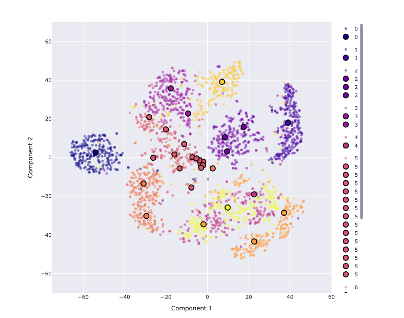

# **Clusters**

---

# **Gradient-Based Clustering**

The optimization problem is:

$$
\arg \min_{S, \gamma_j \geq 0} |S| \quad \text{s.t.} \quad \max_{w \in W} ||\nabla_w F(w, V) - \nabla_w F(w, S)|| \leq \epsilon
$$

---

# **Greedy Algorithms**

1. **Subset Selection**:

$$
F(S_k) \geq \left(1 - \frac{1}{e}\right) F(\text{OPT})
$$

2. **Complexity**:

- Time Complexity: $O(nk)$.