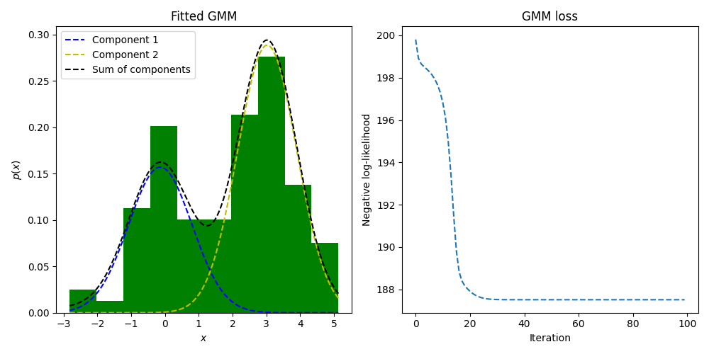
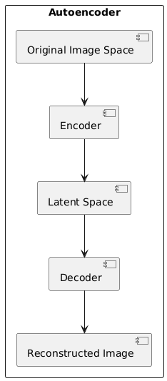
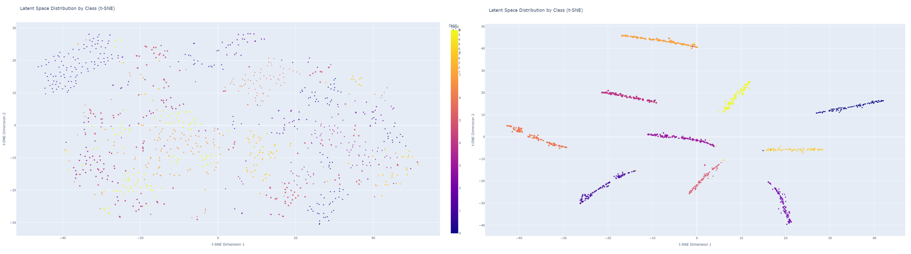
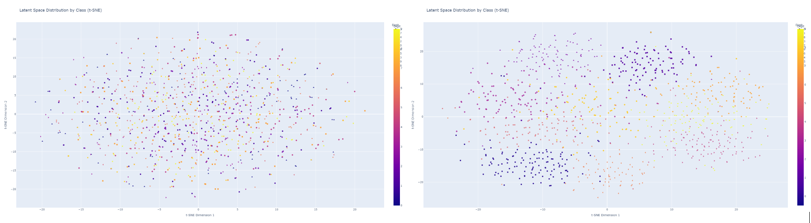
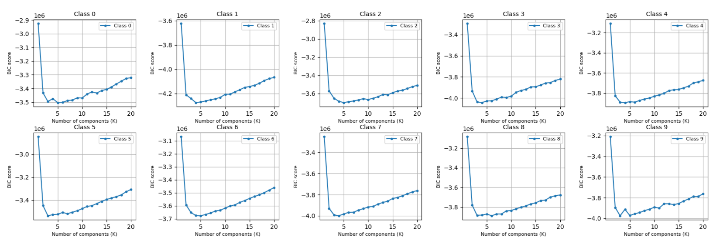

## Visualizing GMM Distribution Learning

- The image shows the learning of a Gaussian Mixture Model (GMMs) with two components ($k=2$).
- The distribution is a linear combination of the two components, but can be any integer number of components:
$$p(z) = \pi_1 \mathcal{N}(\mu_1, \Sigma_1) + \pi_2 \mathcal{N}(\mu_2, \Sigma_2)$$

---
## Compression with Autoencoders (AE) and GMMs

- Different autoencoders are used to train up an encoder to transform images into lower dimensional latent space
- The decoder is also trained to recover the original image
---

## Autoencoder Architectures and Losses

We experimented with vanilla AE with/without contrastive learning and the Variational AE with/without contrastive learning:
1. **Reconstruction Loss**:

$$
L_{\text{recon}}(x, \hat{x}) = ||x - \hat{x}||^2
$$

2. **KL Divergence (regularizer)**:

$$
L_{\text{KL}} = D_{\text{KL}}(q(z|x) || p(z))
$$

3. **Contrastive Learning Loss**:

$$
L_{\text{CL}} = \frac{1}{2N} \sum_{i=1}^{N} (1 - y_i) D_i^2 + y_i \max(0, m - D_i)^2
$$
---

## Visualizing the AE Latent Space
- t-SNE plots below show the AE encoding space without contrastive learning (left) and with contrastive learning (right)
- The effect of the contrastive loss can clearly be seen to pull examples within a class closer together and push examples outside of a class away from each other

---

## Visualizing the VAE Latent Space
- t-SNE plots below show the same latent space with VAE without contrastive learning (left), and with contrastive learning (right)
- Similarly, the VAE without contrastive loss sees the normalized latent space disitributions intermixed, while contrastive learning can be seen to separate classes

---

## Bayesian Information Criterion (BIC) Curve
- BIC metric is used to determine the appropriate number of k GMMs to decompose into to represent the latent distribution
- The below plots show the BIC plots for each class's distribution, each showing that 2 to 3 GMMs satisfy the criterion of model simplicity and goodness-of-fit

$$ \text{BIC} = k \ln(n) - 2 \ln(\widehat{L}) $$
