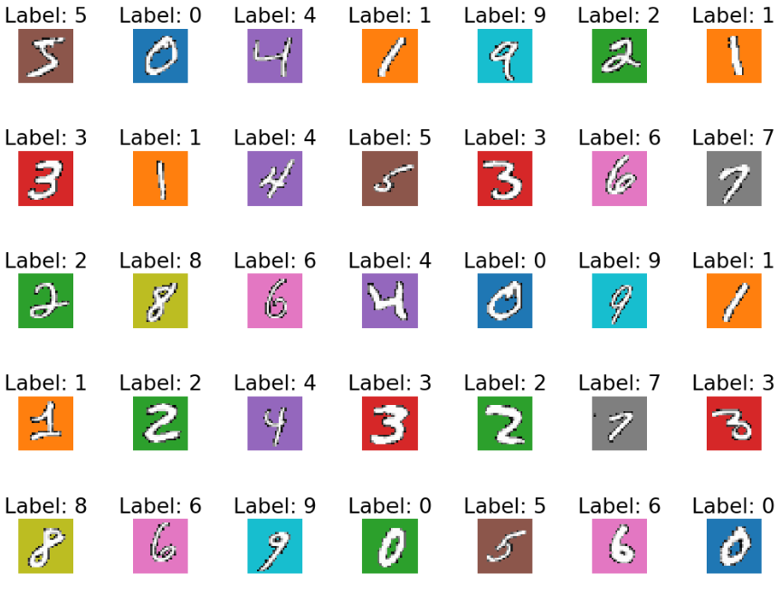

# Information Bottleneck Principle

- A theoretical framework for compression in neural networks.
- Balances:
  - Compression: Reduce information from $x$ to $z$.
  - Relevance: Ensure $z$ retains information about $y$.

---

# **Connection Between VAEs and Information Bottleneck**

- VAEs implicitly optimize an information bottleneck objective by minimizing the following loss:

$$
\mathcal{L} = I(x; z) - \beta I(z; y)
$$

Where:
- $I(x; z)$: Mutual information between $x$ and $z$.
- $I(z; y)$: Mutual information between $z$ and $y$.
- $\beta$: Controls the trade-off.

---

# **Spurious Correlations**

---

# **Spuco Dataset (Large Spurious Feature Difficulty)**

---

# **Vanilla VAE Reconstruction (No Upsampling)**

---

# **Vanilla VAE Reconstruction (With Upsampling)**

---

# **Convolutional VAE Reconstruction (No Upsampling)**

---

# **Convolutional VAE Reconstruction (With Upsampling)**

