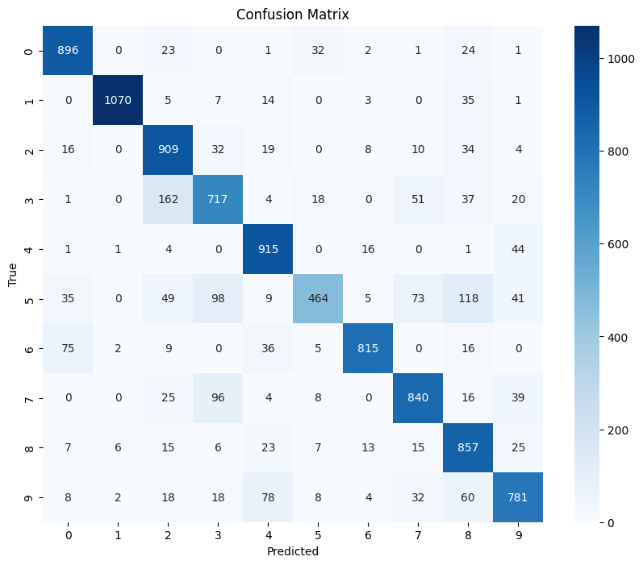

# Baseline Comparison
As a baseline comparison for the performance, subsets of size equal to the compressed model were extracted from the MNIST dataset
- Gradient-Based Clustering
- Random Subset Selection

Each model was evaluated using a CNN classifier

---

# Gradient-Based Exemplar Clustering
Optimization problem:
$$
\arg \min_{S, \gamma_j \geq 0} |S| \quad \text{s.t.} \quad \max_{w \in W} ||\nabla_w F(w, V) - \nabla_w F(w, S)|| \leq \epsilon
$$

1. Train a model (1-3 epochs)
2. Extract last layer gradients
3. k-medoids++ algorithm for exemplar cluster selection 

---
# Baseline Results
### Random Subset
- Test Accuracy on the 10000 test images: 82.64%

---
# Baseline Results
### Gradient Clustering
- Test Accuracy on the 10000 test images: 85.68%

---

# GMM Compression Results
### Auto-Encoder
- Test Accuracy on the 10000 test images: 95.98%
 

---

# Overall Results: Compression vs Accuracy 
 