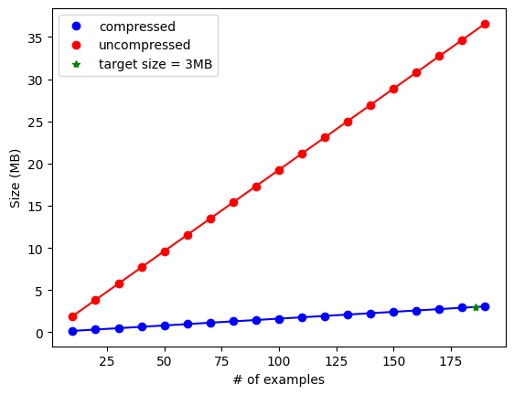
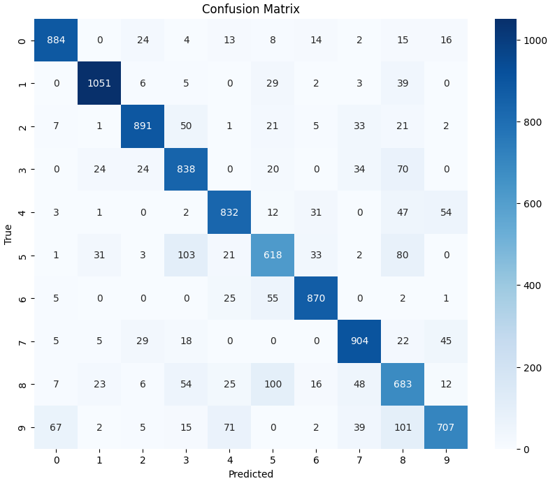
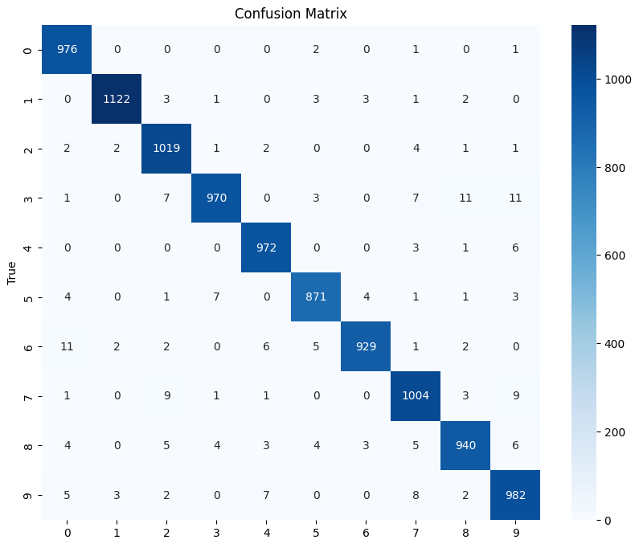

# **Baseline Comparison**
As a baseline comparison for the performance, subsets of size equal to the compressed model were extracted from the MNIST dataset
- Gradient-Based Clustering
- Random Subset Selection

Each model was evaluated using a CNN classifier
<!--  -->

---

# **Gradient-Based Exemplar Clustering**

Optimization problem:

$$
\arg \min_{S, \gamma_j \geq 0} |S| \quad \text{s.t.} \quad \max_{w \in W} ||\nabla_w F(w, V) - \nabla_w F(w, S)|| \leq \epsilon
$$

---
# **Baseline Results**
Test Accuracy of GBEC on the 10000 test images: 85.68%

---

# **GMM Compression Results**

